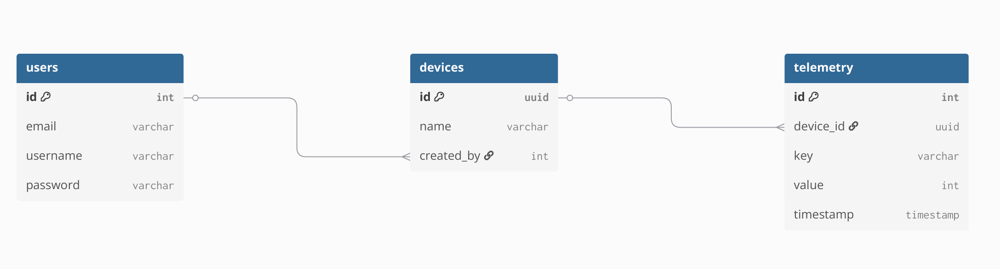
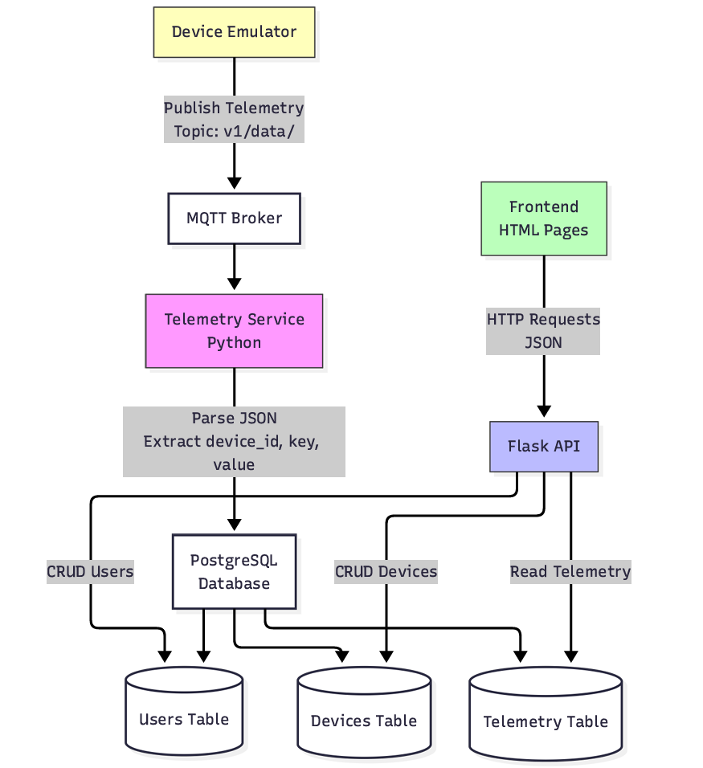

# Simple IoT Project

## Description
Simple IoT system with Flask, MQTT, and PostgreSQL

## ER Diagram


## API List
### Authentication
- POST /login - Login and get JWT token

### Users
- GET /users - Get all users
- POST /users - Create new user
- PUT /users/{id} - Update user
- DELETE /users/{id} - Delete user

### Devices
- GET /devices - Get all devices
- POST /devices - Create new device
- PUT /devices/{id} - Update device
- DELETE /devices/{id} - Delete device

### Telemetry
- GET /telemetry - Get all telemetry data
- GET /telemetry?device_id= - Get telemetry for specific device

## System Diagram


## How to Run

Follow these steps to run the project:

### 1. Start Docker Services (Database + MQTT + Telemetry Service)

```bash
cd service
docker compose up --build